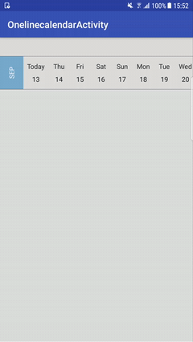

[](https://travis-ci.org/TechIsFun/OneLineCalendar)
[](https://jitpack.io/#techisfun/OneLineCalendar)

# OneLineCalendar

A calendar widget for Android displayed on one line



## Download

```
dependencies {
  compile 'com.github.techisfun:onelinecalendar:0.2'
}
```

## Example usage

- Add the view to your layout:

```xml
<com.github.techisfun.onelinecalendar.OneLineCalendarView
    android:layout_width="match_parent"
    android:layout_height="70dp" />
```

- Then set the listener:

```java
OneLineCalendarView calendarView = (OneLineCalendarView) findViewById(R.id.calendar_view);
calendarView.setOnDateClickListener(new OnDateClickListener() {
    @Override
    public void onDateClicked(@NonNull Date date) {
        Toast.makeText(OnelinecalendarActivity.this,
                SimpleDateFormat.getDateInstance().format(date),
                Toast.LENGTH_SHORT)
                .show();
    }
});
```

License
-------

    Copyright 2017 Andrea Maglie

    Licensed under the Apache License, Version 2.0 (the "License");
    you may not use this file except in compliance with the License.
    You may obtain a copy of the License at

       http://www.apache.org/licenses/LICENSE-2.0

    Unless required by applicable law or agreed to in writing, software
    distributed under the License is distributed on an "AS IS" BASIS,
    WITHOUT WARRANTIES OR CONDITIONS OF ANY KIND, either express or implied.
    See the License for the specific language governing permissions and
    limitations under the License.

